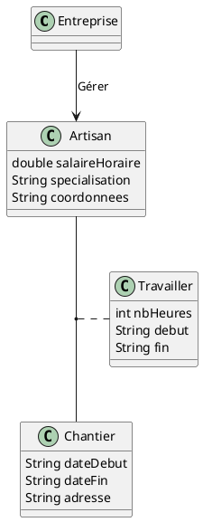

Réalisez un diagramme de classe correspondant au sujet (attributs et associations uniquement).

```plantuml
@startuml

class Entreprise {

}

class Chantier {
    String dateDebut
    String dateFin
    String adresse
}

class Artisan {
    double salaireHoraire
    String specialisation
    String coordonnees
}

class Travailler {
    int nbHeures
    String debut
    String fin
}

Entreprise --> Artisan : "Gérer"
Artisan -- Chantier
(Artisan, Chantier) .. Travailler

@enduml
```